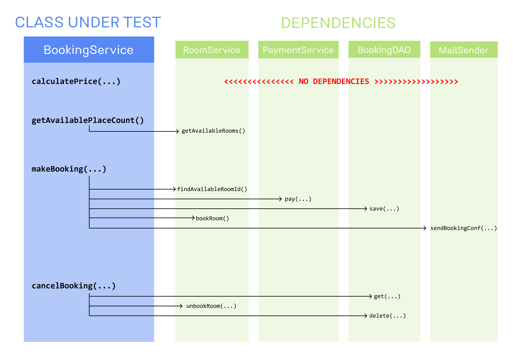

## Section 01 Introduction

Introduction

# What I Learned

# Introduction

# Mocking Theory

1. We usually test single units. 

1. Class to test.
2. Unit test for this class.

- Good OOP java, should have single responsibility.

1. We want to create class for horoscope service class.

- With following behavior defined in **1.**

1. Dependencies

- Ideas is to write unit test for service only, but there is two dependencies.

1. Unit test which was suppose to test **service** class.
    - Under hood it will connect to db and look thought horoscope provider.

2.  This could fail if website is unavailable. Not because test itself is wrong, but the dependencies. This could be fine for **integration test**, but not for unit test.
	- We can solve this using **mocks** 

- To fix this we use following. **Mocks**
    - We will mock
    - We will learn to test behavior of these mocks

# Mocking Frameworks

- In Java world, most popular are **JMockit**, **EASYMOCK** and **Mockito** by far the most popular at the writing time
    - Junit does not provide mocking ability :(

- In JVM world mockito was popular framework when writing tests.
    - Mockito is **popular!**

# What should be mocked?

1. We want mock these out of **BookingService**

- Class under test you can see below 

 

1. Mocking methods in **Service** class and testing them is kinda useless. 
    - Don't mock methods from `BookService`
	    - We want to test all methods from `BookService` and mock only decencies.
