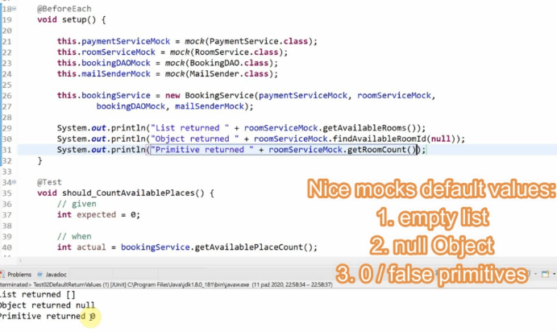
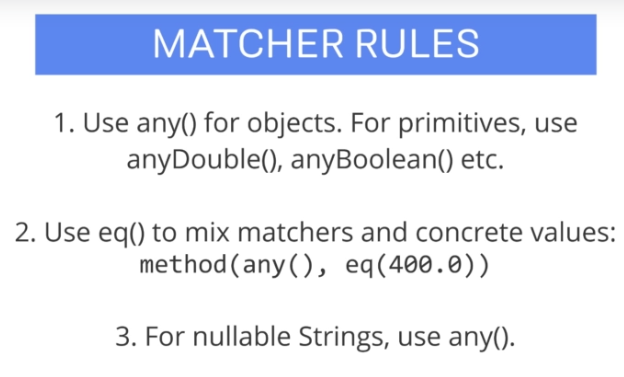

## Section 02 Mockito 3 Basics

Mockito 3 Basics

# What I Learned


# First Mocks

- First mock test example below.

```
package com.mockitotutorial.happyhotel.booking;

import static org.junit.jupiter.api.Assertions.*;

import org.junit.jupiter.api.*;
import static org.mockito.Mockito.*;

import java.time.LocalDate;

class Test01FirstMocks {

	private BookingService bookingService; // Main Service to test dont mock

	private PaymentService paymentServiceMock;
	private RoomService roomServiceMock;
	private BookingDAO bookingDAOMock;
	private MailSender mailSenderMock;

	@BeforeEach
	void setup() {

		this.paymentServiceMock = mock(PaymentService.class);
		this.roomServiceMock = mock(RoomService.class);
		this.bookingDAOMock = mock(BookingDAO.class);
		this.mailSenderMock = mock(MailSender.class);

		this.bookingService = new BookingService(paymentServiceMock, roomServiceMock, bookingDAOMock, mailSenderMock);

	}

	@Test
	void  should_CalculateCorrectPrize_When_CorrectInput() {
		
		// Given
		BookingRequest bookingRequest = new BookingRequest("1", LocalDate.of(2020, 01, 01), LocalDate.of(2020, 01, 05), 2, false);		
		double expected = 4 * 2 * 50.0;
		
		
		// When
		double actual = bookingService.calculatePrice(bookingRequest);
		
		//Then
		assertEquals(expected, actual);
		
	}

}

```

- Following will return **mock** to user `this.paymentServiceMock = mock(PaymentService.class);`

# Default Return Values

- If you don't specify any return values, there different default values. See below.



- By default Mockito uses **nice mocks**.
	- Returning values makes sense.
	- Nice mocks **default values:**
		- Empty list
		- Null Object
		- 0 / false primitives
- We can specify return type for specific input or any all input

- Test from this chapter below.

```
package com.mockitotutorial.happyhotel.booking;

import static org.junit.jupiter.api.Assertions.*;

import org.junit.jupiter.api.*;
import static org.mockito.Mockito.*;

import java.time.LocalDate;

class Test02DefaultRetrunValues {

	private BookingService bookingService; // Main Service to test dont mock

	private PaymentService paymentServiceMock;
	private RoomService roomServiceMock;
	private BookingDAO bookingDAOMock;
	private MailSender mailSenderMock;

	@BeforeEach
	void setup() {

		this.paymentServiceMock = mock(PaymentService.class);
		this.roomServiceMock = mock(RoomService.class);
		this.bookingDAOMock = mock(BookingDAO.class);
		this.mailSenderMock = mock(MailSender.class);

		this.bookingService = new BookingService(paymentServiceMock, roomServiceMock, bookingDAOMock, mailSenderMock);

		
		System.out.println("List returned " + roomServiceMock.getAvailableRooms());
		System.out.println("Object returned " + roomServiceMock.findAvailableRoomId(null));
		System.out.println("Primitive returned "+ roomServiceMock.getRoomCount());
	}
	
	@Test
	void should_CountAvailablePlaces()
	{
		//given
		int expected = 0;
		
		//when
		int actual = bookingService.getAvailablePlaceCount();
			
		//then
		assertEquals(expected, actual);
	}


}

```

# Returning Custom Values

```
when(this.roomServiceMock.getAvailableRooms()).thenReturn(Collections.singletonList(new Room("Room 1", 2)));
```

- **When()** something happens then → do something.
	- Chaining when then.
		- This changes **default behavior** from empty list to **single element list**.
		- Now when `getAvailableRooms()` is called **return list with new Room**.

# Multiple thenReturn Calls

```
@Test
	public void should_CountAvailablePlaces_When_CalledMultipleTimes(){
		
		when(this.roomServiceMock.getAvailableRooms())
		.thenReturn(Collections.singletonList(new Room("Room 1", 5))) 	// First time called should return one room
		.thenReturn(Collections.emptyList());							// Second time called should return empty
		int expectedFirstCall = 5;
		int expectedSecondCall = 0;
		
		// when
		int actualFirst = bookingService.getAvailablePlaceCount();
		int actualSecond = bookingService.getAvailablePlaceCount();
		
		// then
		assertAll(
				() -> 	assertEquals(expectedFirstCall, actualFirst),
				() -> 	assertEquals(expectedSecondCall, actualSecond)
				);

	}
```

- We can chain `.thenReturn` to return different value every other call.
	- First call should return **Room** and second should return **Empty** Array list.

# Throwing Exceptions

- Testing exceptions in **JUNIT 5** way is using **Executable interface**

> In JUnit 5, Executable is the official way to test exceptions. 

```
	@Test
	void  should_ThrowException_When_NoRoomAvailable() {
		
		//Given
		BookingRequest bookingRequest = new BookingRequest("1", LocalDate.of(2020, 01, 01), LocalDate.of(2020, 01, 05), 2, false);		
		when(this.roomServiceMock.findAvailableRoomId(bookingRequest))
		.thenThrow(BusinessException.class);
		
		//When
		Executable executable = () -> bookingService.makeBooking(bookingRequest);
		
		//Then
		assertThrows(BusinessException.class, executable);
	}
```

# Argument Matchers


```
@Test
  void shoud_NotCompleteBooking_When_PriceTooHigh() {

    // Given
    BookingRequest bookingRequest =
        new BookingRequest("1", LocalDate.of(2020, 01, 01), LocalDate.of(2020, 01, 05), 2, true);
    when(this.paymentServiceMock.pay(any(), anyDouble())).thenThrow(BusinessException.class);
    // any() any kind of input
    // When
    Executable executable = () -> bookingService.makeBooking(bookingRequest);

    // Then
    assertThrows(BusinessException.class, executable);
  }
```

- `any()`  will accept any kind of input

- There is golden rules when comes to matcher rules:



1. Usage of **any()** for **object**. For primitives use primitive specific methods like **anyDouble()** or **anyBoolean()**. Tests will fail if you won't use them in correct places!
2. Remember to use **eq()** when using `any()` matchers
3. Matching strings can be tricky! You should use `any()` when matching nullable string.

# Verifying Behaviour

- **Side effect** is if method has other minor method called.
	- We could check these other methods by verifying behavior. 

- We are using **verify** to check if method have been called!
	- or not called!

- Below working method 

```

  @Test
  void should_InvokePayment_When_Prepaid() {

    // Given
    BookingRequest bookingRequest =
        new BookingRequest("1", LocalDate.of(2020, 01, 01), LocalDate.of(2020, 01, 05), 2, true);

    // When

    bookingService.makeBooking(bookingRequest);
    // Then
    verify(paymentServiceMock, times(1)).pay(bookingRequest, 400.0);
    verifyNoMoreInteractions(paymentServiceMock); // Check if paymentServiceMock was called once

  }

```

# Spies

- Default mocks will return **mocks**

- Spies **partial mocks** = dummy object with no real logic
	- Spy is **partial mock**§, uses code from actual class

- Defining "behavior" for spies, is a **other way around** than for mocks


- void methods **does not** work with when then pattern


```

  @Test
  void should_MakeBooking_When_InputOK() {

    // Given
    BookingRequest bookingRequest =
        new BookingRequest("1", LocalDate.of(2020, 01, 01), LocalDate.of(2020, 01, 05), 2, true);

    // When
    String bookingId = bookingService.makeBooking(bookingRequest);
    
    // Then
    verify(bookingDAOMock).save(bookingRequest);
    System.out.println("bookingId=" + bookingId);

  }
  @Test
  void should_CancelBooking_When_InputOK() {

    // Given
	  BookingRequest bookingRequest =
		        new BookingRequest("1", LocalDate.of(2020, 01, 01), LocalDate.of(2020, 01, 05), 2, true);
	  bookingRequest.setRoomId("1.3");
	  String bookingId = "1";
	  
	  doReturn(bookingRequest).when(bookingDAOMock).get(bookingId);
	  // When
	  bookingService.cancelBooking(bookingId);
	  
    // Then

  }

```

# Mocking Void Methods

- Test with void methods

```

	@Test
	void  should_ThrowException_When_MailNotReady() {
		
		//Given
		BookingRequest bookingRequest = new BookingRequest("1", LocalDate.of(2020, 01, 01), LocalDate.of(2020, 01, 05), 2, false);		
		when(this.roomServiceMock.findAvailableRoomId(bookingRequest))
		.thenThrow(BusinessException.class);
//		Does not work
//		when(this.mailSenderMock.sendBookingConfirmation(any())).thenThrow(BusinessException.class);
		doThrow(new BusinessException()).when(mailSenderMock).sendBookingConfirmation(any());
		
		
		//When
		Executable executable = () -> bookingService.makeBooking(bookingRequest);
		
		//Then
		assertThrows(BusinessException.class, executable);
	}

	
	@Test
	void  should_NotThrowException_When_MailNotReady() {
		
		//Given
		BookingRequest bookingRequest = new BookingRequest("1", LocalDate.of(2020, 01, 01), LocalDate.of(2020, 01, 05), 2, false);		
//		Does not work
//		when(this.mailSenderMock.sendBookingConfirmation(any())).thenThrow(BusinessException.class);
		doNothing().when(mailSenderMock).sendBookingConfirmation(any());
		
		
		//When
		bookingService.makeBooking(bookingRequest);
		
		//Then
		// no exception thrown
	}

```


