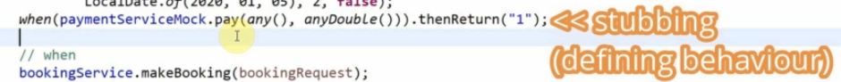
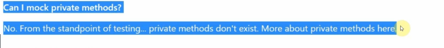
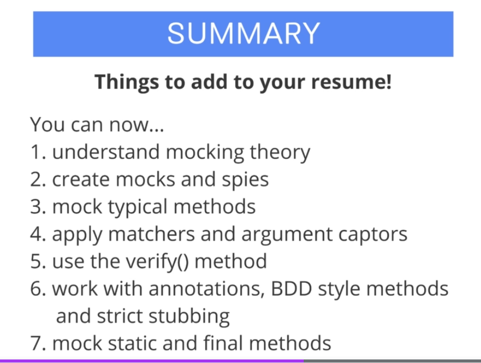

## Section Section 3: More Advanced

More Advanced.

# What I Learned

# Argument Captors

- We can capture given argument.

```

  @Test
  void should_PayCorrectPrice_When_InputOK() {

    // Given
    BookingRequest bookingRequest =
        new BookingRequest("1", LocalDate.of(2020, 01, 01), LocalDate.of(2020, 01, 05), 2, true);

    // When

    bookingService.makeBooking(bookingRequest);
    // Then
    verify(paymentServiceMock, times(1)).pay(eq(bookingRequest), doubleCaptor.capture());
    double capturedArgument = doubleCaptor.getValue();
    
    
    System.out.println(capturedArgument);
    assertEquals(400.0, capturedArgument);
  }
  
  
  @Test
  void should_PayCorrectPrice_When_MultipleCalls() {

    // Given
    BookingRequest bookingRequest =
        new BookingRequest("1", LocalDate.of(2020, 01, 01), LocalDate.of(2020, 01, 05), 2, true);
    BookingRequest bookingRequest2 =
            new BookingRequest("1", LocalDate.of(2020, 01, 01), LocalDate.of(2020, 01, 02), 2, true);

    List<Double> expectedValues = Arrays.asList(400.0, 100.0);
    // When
    bookingService.makeBooking(bookingRequest);
    bookingService.makeBooking(bookingRequest2);
    
    // Then
    verify(paymentServiceMock, times(2)).pay(any(), doubleCaptor.capture());
//    double capturedArgument = doubleCaptor.getValue(); Gets only one value from multiple calls
    List<Double> capturedArguments = doubleCaptor.getAllValues();
    
    
    assertEquals(expectedValues, capturedArguments);
  }

```

# Annotations

- Can remove useless code. This is recommended way of mockito.
- `@Mock` telling mocks.
- `@InjectMocks` injecting mocks.

# Mockito BDD

- Comes from Behavior Driven Development. 

- To match names in given when pattern, we can use BDD. Just different naming pattern.


- When and then changes to given `willReturn`.

```
when(this.roomServiceMock.getAvailableRooms()).thenReturn(Collections.singletonList(new Room("Room 1", 5)));
```

- Changes to 

```
given(this.roomServiceMock.getAvailableRooms()).willReturn(Collections.singletonList(new Room("Room 1", 5)));`
``` 

<hr>

```
verify(paymentServiceMock, times(1)).pay(bookingRequest, 400.0);
``` 

- Changes to

```
then(paymentServiceMock).should(times(1)).pay(bookingRequest, 400.0);`
```

- Example below.

```

	@Test
	public void should_CountAvailablePlaces_When_OneRoomAvailable() throws Exception {
		
		// given
		given(this.roomServiceMock.getAvailableRooms()).willReturn(Collections.singletonList(new Room("Room 1", 5)));
		int expected = 5;
		
		// when
		int actual = bookingService.getAvailablePlaceCount();
		
		// then
		assertEquals(expected, actual);
		}
	
	
	
	  @Test
	  void should_InvokePayment_When_Prepaid() {

	    // Given
	    BookingRequest bookingRequest =
	        new BookingRequest("1", LocalDate.of(2020, 01, 01), LocalDate.of(2020, 01, 05), 2, true);
	    // When
	    bookingService.makeBooking(bookingRequest);
	    // Then
	    then(paymentServiceMock).should(times(1)).pay(bookingRequest, 400.0);
	    verifyNoMoreInteractions(paymentServiceMock); // Check if paymentServiceMock was called once

	  }
```


# Strict Stubbing


```

	  @Test
	  void should_InvokePayment_When_Prepaid() {

	    // Given
	    BookingRequest bookingRequest =
	        new BookingRequest("1", LocalDate.of(2020, 01, 01), LocalDate.of(2020, 01, 05), 2, false);
	   
	    when(paymentServiceMock.pay(any(), anyDouble())).thenReturn("1"); //unnecessary stubbing
	    lenient().when(paymentServiceMock.pay(any(), anyDouble())).thenReturn("1"); //unnecessary stubbing works with lenient()
	    
	    // When
	    bookingService.makeBooking(bookingRequest);
	    
	    // Then
	    // No exception is thrown
	  }

```



- **Stubbing** is defining behavior of your classes.

``` 
when(paymentServiceMock.pay(any(), anyDouble())).thenReturn("1"); //unnecessary stubbing
```

- If this is **defined** in test and **not** actually called → exception is throw since **strict stubbing** expects it to be called. This is called **Strict Stubbing**.
	- **Nice feature**, forces to keep test neat and clean.
- To counter this **Mockito** allows use of `lenient()`.

```
lenient().when(paymentServiceMock.pay(any(), anyDouble())).thenReturn("1"); //unnecessary stubbing works with lenient()
```

- Should not be using `lenient()` in first place, since clean tests are more wanted, meaning **Strict Stubbing** behavior is wanted!

# Mocking Static Methods

- Mockito allows Mock static methods.

- Mocking static methods is still experimental in Mockito, should use Example **PowerMock**.
- To use mocking static methods, needs to enable **experimental**(at the time of 2020) feature in Mockito.

```
	<dependency>
		<groupId>org.mockito</groupId>
		<artifactId>mockito-core
		</artifactId>
		<version>3.5.13</version>
		<scope>test</scope>
	</dependency>
```

To

```
	<dependency>
		<groupId>org.mockito</groupId>
		<artifactId>mockito-inline</artifactId>
		<version>3.5.13</version>
		<scope>test</scope>
	</dependency>
```

- Mocking static method.

```

	  @Test
	  void should_calculateCorrectPrize() {
		  
		  try(MockedStatic<CurrencyConverter> mockedConverter = mockStatic(CurrencyConverter.class)) {

	    // Given
	    BookingRequest bookingRequest =
	        new BookingRequest("1", LocalDate.of(2020, 01, 01), LocalDate.of(2020, 01, 05), 2, false);
	    
	    double expected = 400.0;
	    
	    mockedConverter.when(() -> CurrencyConverter.toEuro(anyDouble())).thenReturn(400.0);
	    
	    // When
	    double actual = bookingService.calculatePrice(bookingRequest);
	    
	    // Then
	    assertEquals(expected, actual);
		  }
	  }
}

```

- Following is kinda stupid to test. Testing always returning 400, by using static mocks.
- Currently, we should make our static Mocks more intelligent.
	- At the moment if we change `CurrencyConverter` test will always pass since mock is tied to `.toEuro()` call.


# Using Mockito Answers

- Mockito **answers** are advanced concept.
  - We provide its lambda.
  
- We want our test to return 80% of previous test, not just static number!

- Previous test would change into following.

```

	@Test
	void should_CalculateCorrectPrice() {
		try (MockedStatic<CurrencyConverter> mockedConverter = mockStatic(
				CurrencyConverter.class)) {
			// given
			BookingRequest bookingRequest = new BookingRequest("1", LocalDate.of(2020, 01, 01),
					LocalDate.of(2020, 01, 05), 2, false);
			double expected = 400.0 * 0.8;
			mockedConverter.when(() -> CurrencyConverter.toEuro(anyDouble()))
					.thenAnswer(inv -> (double) inv.getArgument(0) * 0.8);

			// when
			double actual = bookingService.calculatePriceEuro(bookingRequest);

			// then
			assertEquals(expected, actual);
		}

	}

```

# Mocking Final and Private Methods



- Private is ment to **not** call by external code.
	- Why don't test public method which in case calls private method, does not make sense.
	- If you feel that you need to mock private method → something is **wrong** with class design.

# Summary



- With these you can write wide range of test with mocks.
