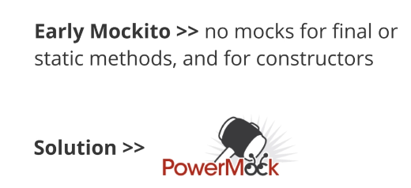
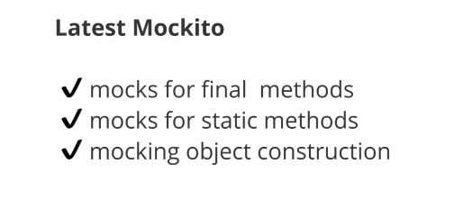
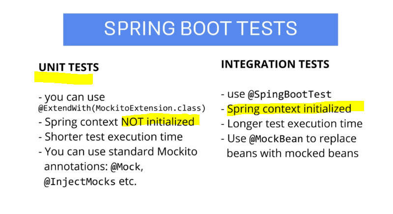

## Section 04 Additional Videos

Additional Videos.

# What I Additional Videos

- In old days **PowerMockito** was used for this reasons.



- Nowadays **Mockito** can.



- **Junit5** does not support **PowerMock**, need to use workarounds 😢.
	- **PowerMock** does **not** update too often, you should not depends on external libraries.

# Spring Boot integration

- **First** type of test when using Spring boot application. **Unit Tests**.

- In Spring environment, Junit test class. Unit test test single classes even with Spring boot environment. Fast to test.


```
package com.mockitotutorial.happyhotel.booking;

import static org.junit.jupiter.api.Assertions.assertEquals;
import static org.mockito.ArgumentMatchers.*;
import static org.mockito.Mockito.*;

import java.time.LocalDate;
import java.util.*;

import org.junit.jupiter.api.Test;
import org.junit.jupiter.api.extension.ExtendWith;
import org.mockito.*;
import org.mockito.junit.jupiter.MockitoExtension;

@ExtendWith(MockitoExtension.class)
class Sample01NoSpringContextTest {

	@InjectMocks
	private BookingService bookingService;
	
	@Mock
	private PaymentService paymentServiceMock;
	
	@Mock
	private RoomService roomServiceMock;
	
	@Spy
	private BookingDAO bookingDAOMock;
	
	@Mock
	private MailSender mailSenderMock;
	
	@Captor
	private ArgumentCaptor<Double> doubleCaptor;

	@Test
	void should_PayCorrectPrice_When_InputOK() {
		// given
		BookingRequest bookingRequest = new BookingRequest("1", LocalDate.of(2020, 01, 01), 
				LocalDate.of(2020, 01, 05), 2, true);
		
		// when
		bookingService.makeBooking(bookingRequest);		
		
		// then
		verify(paymentServiceMock, times(1)).pay(eq(bookingRequest), doubleCaptor.capture());
		double capturedArgument = doubleCaptor.getValue();
		
		assertEquals(400.0, capturedArgument);
	}
	
	@Test
	void should_PayCorrectPrices_When_MultipleCalls() {
		// given
		BookingRequest bookingRequest = new BookingRequest("1", LocalDate.of(2020, 01, 01), 
				LocalDate.of(2020, 01, 05), 2, true);
		BookingRequest bookingRequest2 = new BookingRequest("1", LocalDate.of(2020, 01, 01), 
				LocalDate.of(2020, 01, 02), 2, true);
		List<Double> expectedValues = Arrays.asList(400.0, 100.0);
		
		// when
		bookingService.makeBooking(bookingRequest);		
		bookingService.makeBooking(bookingRequest2);	
		
		// then
		verify(paymentServiceMock, times(2)).pay(any(), doubleCaptor.capture());
		List<Double> capturedArguments = doubleCaptor.getAllValues();
		
		assertEquals(expectedValues, capturedArguments);
	}
		

}

```

- **Second** type of test when using Spring boot application. **Integration tests**.

- Need to initialize the context. Takes little bit more.

- Mocking Bean in Spring.

```
@MockBean
private BookingService bookingService;
```

```
 package com.mockitotutorial.happyhotel.booking;

import static org.junit.jupiter.api.Assertions.assertEquals;
import static org.mockito.Mockito.when;

import java.net.URL;

import org.junit.jupiter.api.BeforeEach;
import org.junit.jupiter.api.Test;
import org.springframework.beans.factory.annotation.Autowired;
import org.springframework.boot.test.context.SpringBootTest;
import org.springframework.boot.test.mock.mockito.MockBean;
import org.springframework.boot.test.web.client.TestRestTemplate;
import org.springframework.boot.web.server.LocalServerPort;
import org.springframework.http.ResponseEntity;

@SpringBootTest(webEnvironment = SpringBootTest.WebEnvironment.RANDOM_PORT)
public class Sample02ControllerSampleTest {

	@LocalServerPort
	private int port;

	private URL base;

	@Autowired
	private TestRestTemplate template;
	
	@BeforeEach
	public void setUp() throws Exception {
		this.base = new URL("http://localhost:" + port + "/greeting");
	}

	@Test
	public void getHello() throws Exception {
		// given
		String expected = "Greetings from The Happy Hotel. We've got enough beds for 10 guests!";

		// when
		ResponseEntity<String> response = template.getForEntity(base.toString(), String.class);
		String actual = response.getBody();

		// then
		assertEquals(expected, actual);
	}

}

```

- **Mockito** can mock **Spring Bean** to return what its want to. Below working code, where mocked bean.

```
 package com.mockitotutorial.happyhotel.booking;

import static org.junit.jupiter.api.Assertions.assertEquals;
import static org.mockito.Mockito.when;

import java.net.URL;

import org.junit.jupiter.api.BeforeEach;
import org.junit.jupiter.api.Test;
import org.springframework.beans.factory.annotation.Autowired;
import org.springframework.boot.test.context.SpringBootTest;
import org.springframework.boot.test.mock.mockito.MockBean;
import org.springframework.boot.test.web.client.TestRestTemplate;
import org.springframework.boot.web.server.LocalServerPort;
import org.springframework.http.ResponseEntity;

@SpringBootTest(webEnvironment = SpringBootTest.WebEnvironment.RANDOM_PORT)
public class Sample02ControllerSampleTest {

	@LocalServerPort
	private int port;

	private URL base;

	@MockBean
	private BookingService bookingService;
	
	@Autowired
	private TestRestTemplate template;
	
	@BeforeEach
	public void setUp() throws Exception {
		this.base = new URL("http://localhost:" + port + "/greeting");
	}

	@Test
	public void getHello() throws Exception {
		// given
		String expected = "Greetings from The Happy Hotel. We've got enough beds for 10 guests!";
		when(bookingService.getAvailablePlaceCount()).thenReturn(10);
		
		
		// when
		ResponseEntity<String> response = template.getForEntity(base.toString(), String.class);
		String actual = response.getBody();

		// then
		assertEquals(expected, actual);
	}

}

```

- **Three** type of test when using Spring boot application with Mock MVC. **Mock MVC**.

- Test with **Spring MVC**

```
package com.mockitotutorial.happyhotel.booking;

import org.junit.jupiter.api.Test;
import org.springframework.beans.factory.annotation.Autowired;
import org.springframework.boot.test.autoconfigure.web.servlet.AutoConfigureMockMvc;
import org.springframework.boot.test.context.SpringBootTest;
import org.springframework.boot.test.mock.mockito.MockBean;
import org.springframework.test.web.servlet.MockMvc;

import static org.mockito.Mockito.when;
import static org.springframework.test.web.servlet.request.MockMvcRequestBuilders.get;
import static org.springframework.test.web.servlet.result.MockMvcResultHandlers.print;
import static org.springframework.test.web.servlet.result.MockMvcResultMatchers.content;
import static org.springframework.test.web.servlet.result.MockMvcResultMatchers.status;

@SpringBootTest
@AutoConfigureMockMvc
public class Sample03MockMvcTest {

	@Autowired
	private MockMvc mockMvc;

	@Test
	public void shouldReturnDefaultMessage() throws Exception {
		// given
		
		// when
		this.mockMvc.perform(get("/greeting"))
			.andDo(print())
		
		// then
			.andExpect(status().isOk())
			.andExpect(content().string("Greetings from The Happy Hotel. We've got enough beds for 10 guests!"));
	}
}
```

- Spies can be also be used in SpringBoot context with `@SpyBean`.

