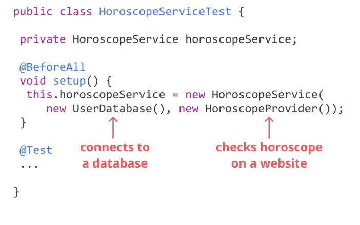
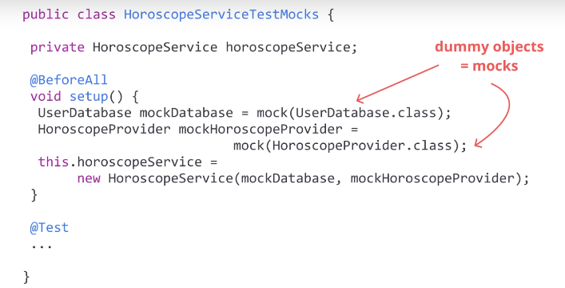
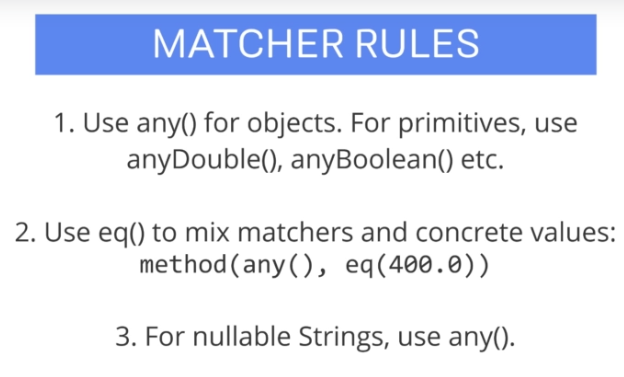

## Mockito: Next-Level Java Unit Testing

All course material from Mockito: Next-Level Java Unit Testing by Adrian Więch

Every section contains my own notes

[The Course at Udemy](https://www.udemy.com/course/mockito3/)   

Insert certificate here when completed

Add here also JUNIT course into this repo
## Progress/Curriculum

- [x] Section 01 - Section 1: First things first
- [ ] Section 02 - Section 2: Mockito 3 Basics
- [ ] Section 03 - Section 3: More Advanced Concepts
- [ ] Section 04 - Section 4: Additional Videos
- [ ] Section 05 - Section 5: Want to Learn More?

# What I Learned 1

- 

- This could fail if website is unavailable
	- We can solve this using mocks
- 
- Junit does not proviode mocking ability :(
	- In Java world, most popular are JMockit, EASYMOCK and Mockito
		- Mockito by far the most popular at the writing time
- Mockito needs at least Java 8 version
- 
- Don't mock methods from BookService
	- Test all mehthods from BookService
- ``new BookingService(paymentService, roomService, bookingDAO, mailSender)``
	- We want to mock out dependencies form this service
		- Basic way to do this is using mock``this.paymentService = mock(PaymentService.class);``
- By default mockito uses nice mocks
	- returns values makes sense
	- Nice mocks default values:
		1. empty list
		2. null Object
		3. 0 / false primitives
- We can specify return type for specific input or any all input
- `when(this.roomServiceMock.getAvailableRooms()).thenReturn(Collections.singletonList(new Room("Room 1", 2)));`
	- When() something happens then -> do something
		- Chaining when then
	- This changes default behavior from empty list to single element list
	- Now when getAvailableRooms() is called return list with new Room 
- ReturningW value first time, different value when calling second time
- We can chain multiple returns 1nd call and 2nd call
`.thenReturn(Collections.singletonList(new Room("Room 1", 5))) 	// First time called should return one room
.thenReturn(Collections.emptyList());							// Second time called should return empty`
	- And assert it with following `		assertAll(
				() -> 	assertEquals(expectedFirstCall, actualFirst),
				() -> 	assertEquals(expectedSecondCall, actualSecond)
				);`
- Testing exception throwing 

`BookingRequest bookingRequest = new BookingRequest("1", LocalDate.of(2020, 01, 01), LocalDate.of(2020, 01, 05), 2, false);		
		when(this.roomServiceMock.findAvailableRoomId(bookingRequest))
		.thenThrow(BusinessException.class);`
	
		Executable executable = () -> bookingService.makeBooking(bookingRequest);
		
		//Then
		assertThrows(BusinessException.class, executable);	

- any() any kind of input
- 

## PowerMockito(todo)
todo argumentCaptor
[todo argumentCaptor](https://www.google.com/search?client=firefox-b-d&q=argument++captor)

