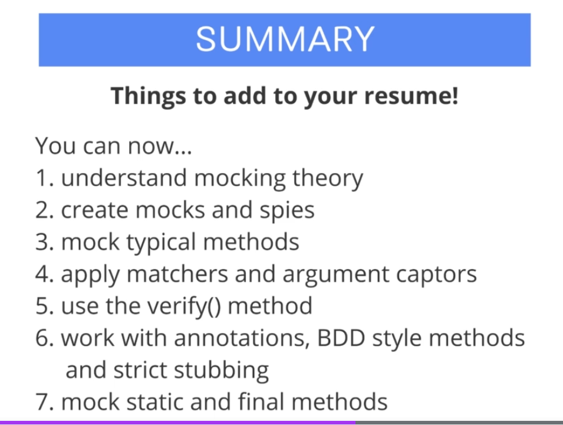

## Mockito: Next-Level Java Unit Testing


All course material from Mockito: Next-Level Java Unit Testing by **Adrian Więch**.

Contains my own notes to better learning experience. 

[The Course at Udemy](https://www.udemy.com/course/mockito3/)   


If the content sparked :fire: your interest, please consider buying the course and start learning :book:

This repository is made with **Eclipse**, therefore it will include configuration files which are related to this IDE this approach will be favored for now. ⚙️

<!-- 
Linkedin puts this shit front, when clicking from private mode x(. Need to put this to make jump working every case
?trk=public_profile_see-credential 
-->


**Note: The material provided in this repository is only for helping those who may get stuck at any point of time in the course. It is very advised that no one should just copy the solutions(violation of Honor Code) presented here.**

- Todo when use springBoot (SpringBoot integration) 
- Todo make captions for every chapter

## Progress/Curriculum

- [x] Section 01 - Section 1: First things first
- [x] Section 02 - Section 2: Mockito 3 Basics
- [x] Section 03 - Section 3: More Advanced Concepts
- [x] Section 04 - Section 4: Additional Videos
- [x] Section 05 - Section 5: Want to Learn More?

# Notes from every chapter


- This could fail if website is unavailable
	- We can solve this using mocks


- Junit does not provide mocking ability :(
	- In Java world, most popular are **JMockit**, **EASYMOCK** and **Mockito** by far the most popular at the writing time
- Mockito needs at least Java 8 version


- Don't mock methods from `BookService`
	- Test all methods from `BookService`
- ``new BookingService(paymentService, roomService, bookingDAO, mailSender)``
	- We want to mock out dependencies form this service
		- Basic way to do this is using mock
		``this.paymentService = mock(PaymentService.class);``
- By default Mockito uses **nice mocks**
	- returns values makes sense
	- Nice mocks default values:
		- Empty list
		- Null Object
		- 0 / false primitives
- We can specify return type for specific input or any all input

```
when(this.roomServiceMock.getAvailableRooms()).thenReturn(Collections.singletonList(new Room("Room 1", 2)));
```

- When() something happens then → do something
	- Chaining when then
		- This changes default behavior from empty list to single element list
		- Now when `getAvailableRooms()` is called return list with new Room 
- Returning value first time, different value when calling second time
- We can chain multiple returns 1:nd call and 2nd call

```
.thenReturn(Collections.singletonList(new Room("Room 1", 5))) 	// First time called should return one room
.thenReturn(Collections.emptyList());							// Second time called should return empty
```

- And assert it with following

```		assertAll(
				() -> 	assertEquals(expectedFirstCall, actualFirst),
				() -> 	assertEquals(expectedSecondCall, actualSecond)
				);
```

- Testing exception throwing 

```
BookingRequest bookingRequest = new BookingRequest("1", LocalDate.of(2020, 01, 01), LocalDate.of(2020, 01, 05), 2, false);		
		when(this.roomServiceMock.findAvailableRoomId(bookingRequest))
		.thenThrow(BusinessException.class);`
	
		Executable executable = () -> bookingService.makeBooking(bookingRequest);
		
		//Then
		assertThrows(BusinessException.class, executable);	
```

- `any()` any kind of input


* `verify(paymentServiceMock).pay(bookingRequest, 400.0);`
* Verify `pay()` is called from `paymentServiceMock` with these `(bookingRequest, 400.0)` arguments
* `verifyNoMoreInteractions(paymentServiceMock);` // Check if `paymentServiceMock` was called once
	
- Spies partial mocks = dummy object with no real logic
	- spy = real object with real 

- Defining "behavior" for spies, is a other way around than for mocks


- Spy is partial mock, uses code from actual class
- void methods does not fork with when then pattern

```
when(this.mailSenderMock.sendBookingConfirmation(any())).thenThrow(BusinessException.class);
```

- We need `doThrSow`
- If you want exception from void method use `doThrow.when` pattern
- Argument captor allows us to capture arguments passed to methods
 
```
verify(paymentServiceMock, times(1)).pay(eq(bookingRequest), doubleCaptor.capture());
double capturedArgument = doubleCaptor.getValue();
```

- Capturing argument which was passed to Pay() method

- Old way declaring mocks`this.paymentServiceMock = mock(PaymentService.class);`
- New and recommended way is using annotations `@Mock` replaces upper declaration

- To match names in given when pattern, we can use BDD. Just different naming pattern


- When and then changes to given `willReturn`

```
when(this.roomServiceMock.getAvailableRooms()).thenReturn(Collections.singletonList(new Room("Room 1", 5)));
```

- Changes to 

```
given(this.roomServiceMock.getAvailableRooms()).willReturn(Collections.singletonList(new Room("Room 1", 5)));`
``` 

<hr>

```
verify(paymentServiceMock, times(1)).pay(bookingRequest, 400.0);
``` 

- Changes to

```
then(paymentServiceMock).should(times(1)).pay(bookingRequest, 400.0);`
```

- **Strict stubbing**
- Using annotation in Mockito turns on feature called **Strict stubbing**`@ExtendWith(MockitoExtension.class)`


- Stubbing is defining behavior of your classes

``` 
when(paymentServiceMock.pay(any(), anyDouble())).thenReturn("1"); //unnecessary stubbing
```

- If this is defined in test and not actually called → exception is throw since **strict stubbing** expects it to be called 
	- Nice feature, forces to keep test neat and clean
- to counter this **Mockito** allows use of `lenient()`

```
lenient().when(paymentServiceMock.pay(any(), anyDouble())).thenReturn("1"); //unnecessary stubbing works with lenient()
```

- Should not be using `lenient()` in first place, since clean tests are more wanted!

- Mocking static methods is still experimental in Mockito, should use Example **PowerMock**
- To use mocking static methods, needs to enable **experimental**(at the time of 2020) feature in Mockito

```
	<dependency>
		<groupId>org.mockito</groupId>
		<artifactId>mockito-core
		</artifactId>
		<version>3.5.13</version>
		<scope>test</scope>
	</dependency>
```

To

```
	<dependency>
		<groupId>org.mockito</groupId>
		<artifactId>mockito-inline</artifactId>
		<version>3.5.13</version>
		<scope>test</scope>
	</dependency>
```

- Mocking static method

```
	  @Test
	  void should_calculateCorrectPrize() {
		  
		  try(MockedStatic<CurrencyConverter> mockedConverter = mockStatic(CurrencyConverter.class)) {

	    // Given
	    BookingRequest bookingRequest =
	        new BookingRequest("1", LocalDate.of(2020, 01, 01), LocalDate.of(2020, 01, 05), 2, false);
	    
	    double expected = 400.0;
	    
	    mockedConverter.when(() -> CurrencyConverter.toEuro(anyDouble())).thenReturn(400.0);
	    
	    // When
	    double actual = bookingService.calculatePrice(bookingRequest);
	    
	    // Then
	    assertEquals(expected, actual);
		  }
	  }
}

```

- Following is kinda stupid to test. Testing always returning 400, by using static mocks

- Currently, we should male our static Mocks more intelligent
	- At the moment if we change `CurrencyConverter` test will always pass since mock is tied to `.toEuro()` call
	- Mockito provides this using **Answer**, they are advanced concepts in mockito
- Previous test would change into following

```
	@Test
	void should_CalculateCorrectPrice() {
		try (MockedStatic<CurrencyConverter> mockedConverter = mockStatic(
				CurrencyConverter.class)) {
			// given
			BookingRequest bookingRequest = new BookingRequest("1", LocalDate.of(2020, 01, 01),
					LocalDate.of(2020, 01, 05), 2, false);
			double expected = 400.0 * 0.8;
			mockedConverter.when(() -> CurrencyConverter.toEuro(anyDouble()))
					.thenAnswer(inv -> (double) inv.getArgument(0) * 0.8);

			// when
			double actual = bookingService.calculatePriceEuro(bookingRequest);

			// then
			assertEquals(expected, actual);
		}

	}
```

- At the time of this recording(2020) Mockito is able to mock **final** methods, using experimental features. Using `mockito-inline` in POM

- We can use this in normal and static methods a like`thenAnswer(inv -> (double) inv.getArgument(0) * 0.8);` 

- What Mockito says about private method mocking


- Private is ment to **not** call by external code 
	- Why don't test public method which in case calls private method, does not make sense.
	- If u feel that u need to mock private method → something is **wrong** with class design




## PowerMockito

- In old days **PowerMockito** was used for this reasons


- Nowadays **Mockito** can 


- **Junit5** does not support PowerMock, need to use workarounds 😢
	- PowerMock does **not** update too often, you should not depends on external libraries

- [AdditionalInfoLink](https://blog.jayway.com/2013/03/05/beyond-mocking-with-powermock/)

# Learn Java Unit Testing with Junit & Mockito in 30 Steps


All course material from Learn Java Unit Testing with Junit & Mockito in 30 Steps by **Ranga Karanam** from legendary **in28minutes**.

Contains my own notes to better learning experience with some course content. 

[The Course at Udemy](https://www.udemy.com/course/mockito-tutorial-with-junit-examples/)

[Homepage of Maker](https://www.in28minutes.com/)

[Github of project](https://github.com/in28minutes/MockitoTutorialForBeginners)

If the content sparked :fire: your interest, please consider buying the course and start learning :book:

This repository is made with **Eclipse**, therefore it will include configuration files which are related to this IDE this approach will be favored for now. ⚙️

<br>

<!-- 
Linkedin puts this shit front, when clicking from private mode x(. Need to put this to make jump working every case
?trk=public_profile_see-credential 
-->


**Note: The material provided in this repository is only for helping those who may get stuck at any point of time in the course. It is very advised that no one should just copy the solutions(violation of Honor Code) presented here.**

- Todo make captions for every chapter

## Progress/Curriculum

- [x] [Section 01](https://github.com/developersCradle/mockito-and-junit-java-unit-testing/tree/main/Section%2001%20JunitAndMockito) - Introduction ✔️
- [X] [Section 02](https://github.com/developersCradle/mockito-and-junit-java-unit-testing/tree/main/Section%2002%20JunitAndMockito) - Unit Testing with Junit ✔️
- [x] [Section 03](https://github.com/developersCradle/mockito-and-junit-java-unit-testing/tree/main/Section%2003%20Getting%20Ready%20for%20Mockito) - Getting Ready for Mockito ✔️
- [X] [Section 04](https://github.com/developersCradle/mockito-and-junit-java-unit-testing/tree/main/Section%2004%20Need%20For%20Mockito) - Need For Mockito ✔️
- [x] [Section 05](https://github.com/developersCradle/mockito-and-junit-java-unit-testing/tree/main/Section%2005%20Mockito%20Basics) - Mockito Basics ✔️
- [ ] [Section 06](https://github.com/developersCradle/mockito-and-junit-java-unit-testing/tree/main/Section%2006%20Mockito%20Advanced) -  Mockito Advanced
- [ ] [Section 07](https://github.com/developersCradle/mockito-and-junit-java-unit-testing/tree/main/Section%2007%20Powermock%20with%20Mockito) - Powermock with Mockito


