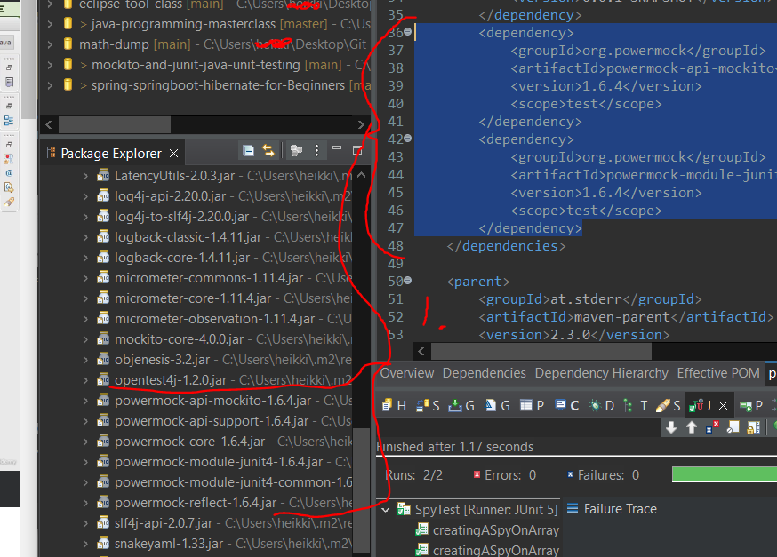

## Section 07 Powermock with Mockito

PowerMock with Mockito

# What I Learned

# Step 15 : Setting up PowerMock and SystemUnderTest

- POM for powermock

```
<dependency>
			<groupId>org.powermock</groupId>
			<artifactId>powermock-api-mockito</artifactId>
			<version>1.6.4</version>
			<scope>test</scope>
		</dependency>
		<dependency>
			<groupId>org.powermock</groupId>
			<artifactId>powermock-module-junit4</artifactId>
			<version>1.6.4</version>
			<scope>test</scope>
		</dependency>
```



1. As you can see, even thought POM has 2 dependencies, more than one library gets pulled, since those libraries has decencies also

- To use PowerMock we need initialize this class with following

```

@RunWith(PowerMockRunner.class)
@PrepareForTest({ UtilityClass.class})
public class PowerMockitoMockingStaticMethodTest {
 code here ...
}

```
- In where the static method lies  `@PrepareForTest({ UtilityClass.class})`

- To mock static method, we do following

```
		PowerMockito.mockStatic(UtilityClass.class);//Get it powermock prepared
		when(UtilityClass.staticMethod(anyLong())).thenReturn(150);
```

- In PowerMock, to verify that method was called, we use

```

PowerMockito.verifyStatic(); //Get powermock ready for checking
UtilityClass.staticMethod(1 + 2 + 3);

```

- Full test code below

```
@RunWith(PowerMockRunner.class)
@PrepareForTest({ UtilityClass.class})
public class PowerMockitoMockingStaticMethodTest {

	@Mock
	Dependency dependencyMock;

	@InjectMocks
	SystemUnderTest systemUnderTest;

	@Test
	public void powerMockito_MockingAStaticMethodCall() {

		when(dependencyMock.retrieveAllStats()).thenReturn(
				Arrays.asList(1, 2, 3));

		PowerMockito.mockStatic(UtilityClass.class); //Get it powermock prepared

		when(UtilityClass.staticMethod(anyLong())).thenReturn(150);

		assertEquals(150, systemUnderTest.methodCallingAStaticMethod());

		//To verify a specific method call
		//First : Call PowerMockito.verifyStatic() 
		//Second : Call the method to be verified
		PowerMockito.verifyStatic();
		UtilityClass.staticMethod(1 + 2 + 3);

		// verify exact number of calls
		//PowerMockito.verifyStatic(Mockito.times(1));

	}
}
```

> Lot of things to use PowerMock!

# Step 16 : Invoking Private Methods

- No time to refactor, but we wan't to test private method

- Example mocking **private mock** with PowerMock.

```
	@Test
	public void powerMockito_CallingAPrivateMethod() throws Exception {
		when(dependencyMock.retrieveAllStats()).thenReturn(
				Arrays.asList(1, 2, 3));
		long value = (Long) Whitebox.invokeMethod(systemUnderTest,
				"privateMethodUnderTest");
		assertEquals(6, value);
	}
```

# Step 17 : Mocking a Constructor